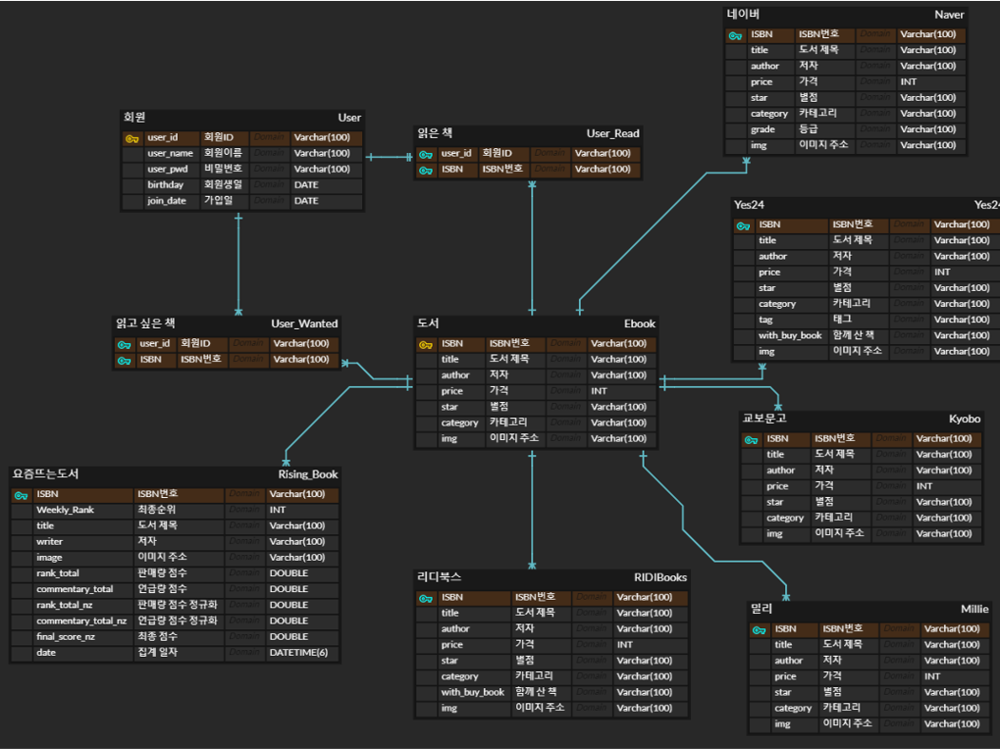

<div align=center>
  
</div>


## 발리의 서재
E-book 통합 관리 시스템

주요 E-book 사이트의 소장 도서 정보를 검색 및 확인할 수 있고, 인기 도서와 개인별 맞춤 도서를 추천해주는 웹서비스
<br><br>


## 👑 제공 서비스

- **E-book 통합 관리 기능**:

 1. 도서 상세 정보 제공
 2. 사이트 별 도서 가격 비교
 3. 도서 검색 기능(읽은 책, 읽고 싶은 책 등록)
 4. 서울시 종이도서관 위치 알리미

- **회원 기능**: 회원가입, 회원탈퇴, 정보 수정, 로그인, 로그아웃

- **추천 기능**:
 1. 각 사이트 별  인기 도서 순위 확인
 2. 요즘 뜨는 도서 추천
 3. 고객 맞춤 도서 추천


<br><br>

## 📌 프로젝트 정보
- 멀티캠퍼스 데이터 분석 & 엔지니어 취업 캠프 (python) 23회차
- 문제해결 빅데이터 활용 프로젝트
- 기간: 2023.03.09 ~ 2023.03.24
- 주제: E-book 통합 관리 시스템
- 팀명: 4조 발리의 서재
- 서비스명: 발리의 서재
- 결과: 최우수상 수상🥇
- PPT: [발리의 서재 상세 프레젠테이션 파일 (링크)](https://drive.google.com/file/d/1r7OYXXEq2BQspzqnDQAMYYwwIUS6qEzZ/view?usp=sharing)

<br>


## 🍉 기술 스택


<br>

## 🍒 ERD


<br>


## 👶 팀원 소개

<table border="" cellspacing="0" cellpadding="0" max-width="2000px">
    <tr width="100">
        <td align="center"><a href= "https://github.com/sumin895">정수민 (조장)</a></td>
        <td align="center"><a href= "https://github.com/yoonjong8739">남윤종</a></td>
        <td align="center"><a href= "https://github.com/seyeon-shijuan">박세연</a></td>
        <td align="center"><a href= "https://github.com/shjiinn">손혜진</a></td>
        <td align="center"><a href= "https://github.com/sdh0729">신동후</a></td>
    </tr>
    <tr width="100">
      <td align="center">
        교보문고 크롤링<br>
        회원기능 및<br>
        도서기능 개발<br>
        추천시스템 서빙
      </td>
      <td align="center">
        Yes24 크롤링<br>
        지도 시각화<br>
        추천시스템 개발
      </td>
      <td align="center">
        네이버 크롤링<br>
        메인 및 레이아웃<br>
        요즘뜨는도서 개발<br>
        Django 설계, 배포
      </td>
      <td align="center">
        밀리의서재 크롤링<br>
        사이트별 도서순위
      </td>
      <td align="center">
        리디북스 크롤링<br>
        웹 디자인
      </td>
   </tr>
</table>

<br>


## 💀 스켈레톤

```
\home\lab18\django\Ebook\
│
├── myvenv                    # 가상환경
│
└── Ebook
    │
    ├── requirements.txt      # 필요 패키지
    ├── Ebook.sock            # 소켓
    ├── manage.py
    ├── media                 # 유저가 업로드 한 파일
    ├── static
    │    │
    │    ├── user_app
    │    ├── book_app
    │    ├── book_rank_app
    │    ├── map_app
    │    └── trend_book_app   # HTML에 연결되는 개발 리소스
    │        │
    │        ├── slide.js
    │        ├── mypic.jpg
    │        └── styles.css ...
    │
    ├── templates       #  공용 html
    │    │
    │    ├── index.html
    │    └── base-layout.html
    │
    ├── user_app     # 개별 앱 (Feature)
    ├── book_app
    ├── book_rank_app
    ├── map_app
    ├── trend_book_app
    │    │
    │    ├── templates
    │    │    |
    │    │    └── trend_book_app
    │    │        |
    │    │        └── trend-book.html    # 개별 앱의 HTML 파일
    │    │
    │    ├── __init__.py
    │    ├── apps.py
    │    ├── models.py
    │    ├── urls.py
    │    └── views.py
    │
    └── Ebook
        │
        ├── __init__.py
        ├── urls.py
        ├── settings.py
        └── wsgi.py
```

